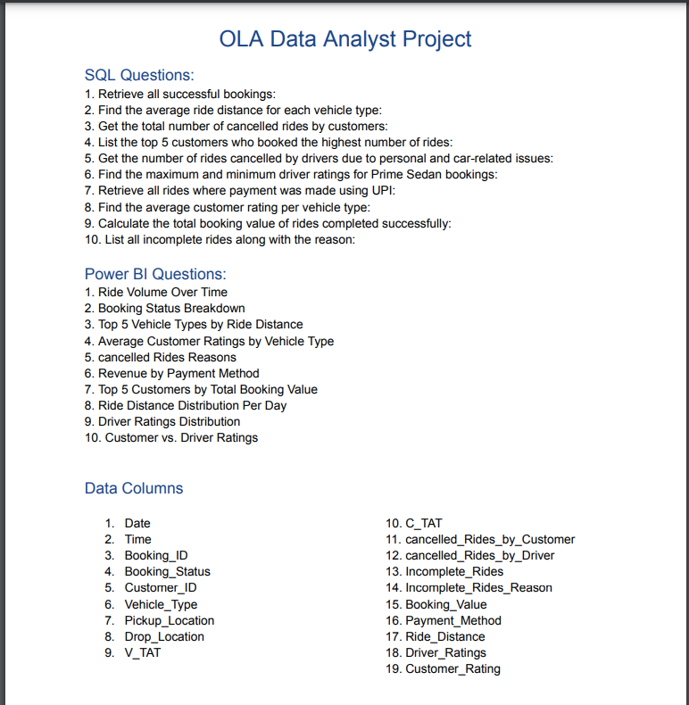

# 🚖 OLA Data Analysis | SQL & Power BI Dashboard  

📊 **End-to-End Data Analysis of Ola Rides using SQL, Power BI, and Excel**  

🚀 This project provides **data-driven insights into ride trends, cancellations, revenue, and customer ratings** using:  
✅ **SQL Queries** – Data extraction & transformation  
✅ **Power BI Dashboard** – Interactive visualizations  
✅ **Excel Processing** – Data cleaning & structuring  

---

## 📌 Project Overview  
This project analyzes **Ola ride data** to uncover business insights. Key aspects covered:  
✔ **Ride trends & booking status breakdown**  
✔ **Cancellations by customers & drivers**  
✔ **Revenue distribution by payment method**  
✔ **Top customers & vehicle types by ride distance**  
✔ **Customer vs. Driver Ratings**  

📌 **Project Workflow:**  
  

---

## 🛠️ Tools Used  
🔹 **SQL** – For data extraction & querying  
🔹 **Power BI** – For dashboard creation & visualization  
🔹 **Excel** – For data pre-processing  

---

## 🔍 Data Insights & Analysis  

### 📌 SQL Analysis  
✔ Retrieve total successful bookings  
✔ Find the **average ride distance** per vehicle type  
✔ Identify the **top 5 customers** based on rides & booking value  
✔ Analyze **cancellation reasons** from customers & drivers  
✔ Compute **customer & driver ratings distribution**  

📌 **Check the SQL Query Results:**  
📄 **[`SQL Analysis Answers`](./OLA_SQL-ANSWERS.png)**  

---

### 📊 Power BI Dashboard  
Created an **interactive dashboard** to visualize ride data trends:  
📈 **Ride Volume Over Time**  
📊 **Booking Status Breakdown**  
🚗 **Top 5 Vehicle Types by Ride Distance**  
💳 **Revenue by Payment Method**  
⭐ **Customer vs. Driver Ratings**  

📌 **Check the Power BI Dashboard Output:**  
📄 **[`Power BI Dashboard Answers`](./OLA_POWER_BI-ANSWERS.png)**  

---

## 📂 Repository Files  
📄 **[`OLA_DATASET.csv`](./OLA_DATASET.csv)** – Raw ride dataset  
📝 **`README.md`** – Project details and insights  
🖼 **[`OLA_QUESTIONS.png`](./OLA_QUESTIONS.png)** – Analysis plan & questions  
📄 **[`OLA_SQL-ANSWERS.png`](./OLA_SQL-ANSWERS.png)** – SQL analysis results  
📄 **[`OLA_POWER_BI-ANSWERS.png`](./OLA_POWER_BI-ANSWERS.png)** – Power BI dashboard output  

---

## 🚀 How to Use This Project?  
1️⃣ **Download the dataset** – [`OLA_DATASET.csv`](./OLA_DATASET.csv)  
2️⃣ **Run SQL queries** to extract insights – [`OLA_SQL-ANSWERS.png`](./OLA_SQL-ANSWERS.png)  
3️⃣ **Explore the Power BI dashboard insights** – [`OLA_POWER_BI-ANSWERS.png`](./OLA_POWER_BI-ANSWERS.png)  

---

## 📢 Let's Connect!  
💡 If you liked this project, feel free to ⭐ star the repository and share your thoughts!  

🔗 **Connect with me on LinkedIn** – [Rohit Panwar](https://www.linkedin.com/in/rohit-panwar22/)  

---

